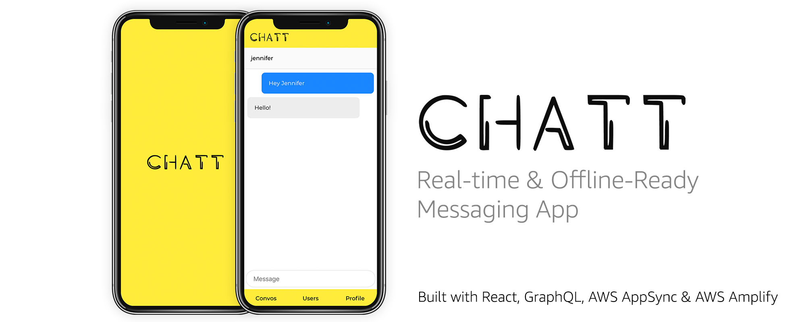
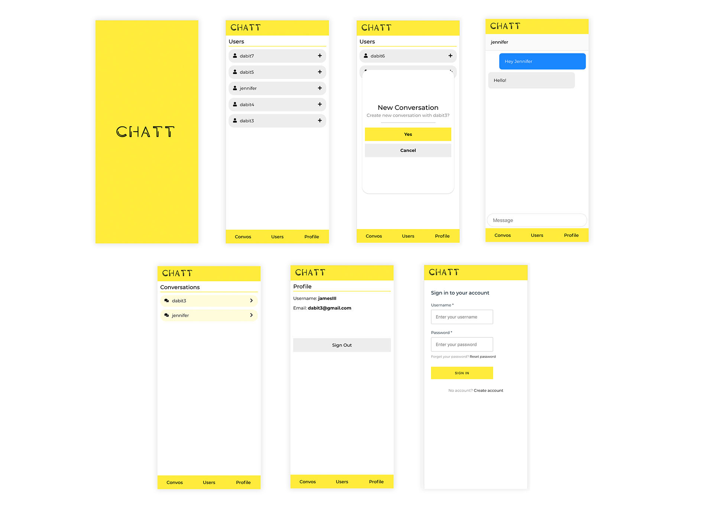

## Chatt

Real-Time Offline Ready Chat App written with GraphQL, AWS AppSync, & AWS Amplify

## Features

- User management
- Routing (React Router)
- Real-time
- Offline ready (conflict resolution handled for you when user comes back online)

## Technologies

- AWS AppSync
- AWS Amplify
- GraphQL
- MobX
- React Router
- React Apollo
- Glamor

## Screens



## Building the App

1. Make sure you are on the newest version of the AWS Amplify CLI

```sh
npm install -g @aws-amplify/cli@multienv
```

2. Clone Chatt

```sh
git clone https://github.com/aws-samples/aws-appsync-chat.git
```

3. Install dependencies

```sh
npm install
```

4. Initialize the amplify project

```sh
amplify init
```
- Enter a name for the environment __master__

5. Push the new resources to the cloud

```sh
amplify push
```

6. Run the project

```sh
npm start
```
## Hosting with the AWS Amplify Console

The [AWS Amplify Console](https://console.amplify.aws) provides continuous deployment and hosting for modern web apps (single page apps and static site generators) with serverless backends. Continuous deployment allows developers to deploy updates to either the frontend or backend (Lambda functions, GraphQL resolvers) on every code commit to the Git repository.

1. Push your code to a Git repository of your choice.
1. Login to the [AWS Amplify Console](https://console.aws.amazon.com/amplify/home) and choose **Connect app**
1. Connect your repository and branch.
1. Accept the default build settings.
1. Give the Amplify Console permission to deploy backend resources with your frontend. This will allow the Console to detect changes to your backend on every code commit. If you do not have a service role, follow the prompts to create one.
1. Review your changes and then choose **Save and deploy**. You app will now be available at `https://master.unique-id.amplifyapp.com`.

## About

### Schema

This application utilizes 4 database tables:

- User table (stores user's identity information)
- Conversation table (stores conversations)
- Messages table (stores messages)
- ConvoLinkTable (stores relations between conversations & users)

## License

This library is licensed under the Apache 2.0 License. 
